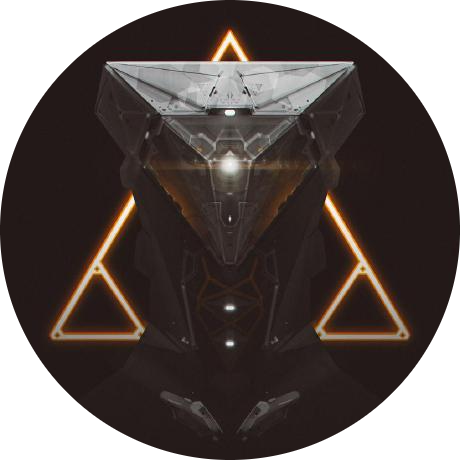
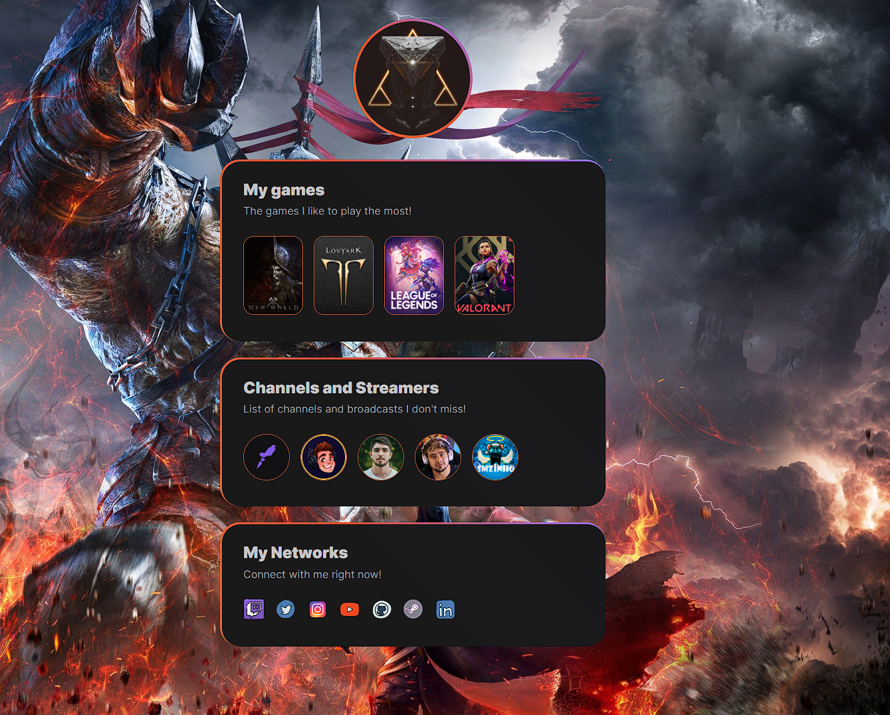

<h1 align="center">
  < NLW-Esports - Trilha Explorer />
</h1>
<h2 align="center">
  
</h2>

## :man_artist: Autor

[kaduej](https://github.com/kaduej) :wave:

## :man_teacher: Professor

- **[@Mayk Brito](https://github.com/maykbrito)**

- **[Rockeseat NLW ](https://rseat.in/nlw-edicao-esports)**

## :computer: Descrição
Nesse projeto utilizei:

:point_right: HTML

:point_right: CSS 

- Layout com fácil acesso a plataformas dos meus jogos e streamers favoritos, assim como, minhas redes sociais.
- Através da trilha Explorer da NLW Esports ( *[Next Level Week eSports](https://nextlevelweek.com/)* ), um projeto da *[🚀@Rocketseat](https://github.com/Rocketseat)*, e dos ensinamentos do educador *[@Mayk Brito](https://github.com/maykbrito)*.
- Criamos uma página com conteúdo voltado para o público gamer, onde facilmente se poderia acessar canais de jogos e streamers que o usuário mais acessava cotidianamente.
- Além da parte de networking, onde usuários poderiam adiconar seus perfis para que pudessem ser encontrados nas redes sociais.

## :heavy_exclamation_mark: Observações
_*_Esse é meu primeiro projeto, estarei atualizando conforme o decorrer das aulas.
E pretendo continuar estudando e buscando cada vez mais para meu aperfeiçoamente pessoal e profissional para que eu me torne um Dev!_*_

  #Foco!
<h2 align="center">
  🚀 Prévia do layout do projeto
</h2>

  

###### :pushpin: Você pode acessa-lo através desse <a href='https://kaduej.github.io/NLWeSports/'>Link!</a>
###### :pushpin: Você pode acessar o projeto original no Figma através desse <a href='https://www.figma.com/file/x0V3FyaVbK8OA1UBz44wmX/NLW-eSports-(Community)?node-id=79%3A2502'>Link!</a>
